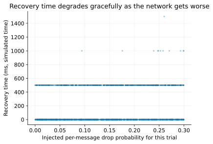
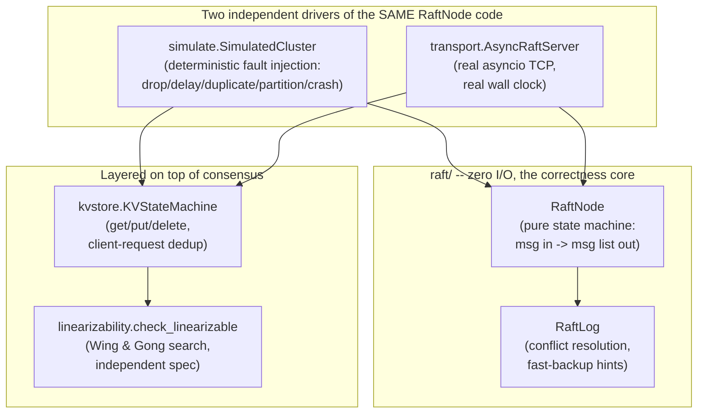
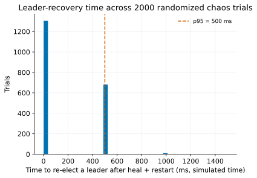
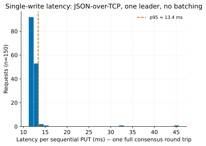
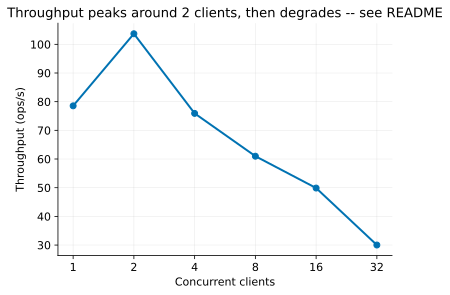

# raft-kv-store


A from-scratch implementation of the Raft consensus protocol (Ongaro &
Ousterhout, 2014) and a linearizable replicated key-value store built on
top of it, with a linearizability checker written from scratch to prove
it. The consensus algorithm itself has **zero third-party dependencies** —
only the Python 3.11 standard library — and is validated by 91 tests: 33
direct unit/property tests against the message-handling logic, 48
randomized fault-injection trials (crashes, network partitions, message
loss and duplication) that continuously check Raft's five safety
properties, and a from-scratch linearizability checker run against a
genuinely concurrent client workload. A separate 2,000-trial verification
campaign (`scripts/chaos_campaign.py`) found **zero safety violations**.
A live, real-socket, 3-process demo (`scripts/run_demo.py`) writes a key,
kills the leader process outright, and shows a new leader takes over
without losing data.

```bash
pip install -r requirements.txt
pytest -q                              # 91 tests, ~0.6s, no network required
python3 scripts/run_demo.py            # real 3-process cluster; kills the leader mid-demo
python3 scripts/chaos_campaign.py --trials 2000   # the larger verification campaign
python3 scripts/benchmark.py           # live-cluster latency/throughput numbers
```



*Recovery time under a 2,000-trial randomized chaos campaign (node crashes, partitions, packet loss/duplication) — degrades gracefully rather than falling off a cliff as injected packet loss rises, the behavior Raft's randomized election timeouts are designed to produce. Full writeup in [Verification campaign](#verification-campaign) below.*

## Why this exists

Raft is famous for being "designed to be understandable" and *still*
being notoriously easy to get subtly wrong — the paper itself exists
because the original Paxos formulations were hard enough to implement
correctly that a whole protocol was redesigned around implementability.
This project treats that claim as a testable one: implement the full
algorithm (not a toy subset — real log-conflict resolution, the
Figure-8 commit-safety rule, crash persistence, a real client protocol
with exactly-once semantics), and prove it's correct the same way actual
distributed-systems teams do — property-based fault injection at scale,
not a handful of manually-checked scenarios. Two real bugs were found and
fixed this way during development (see below), including a request-vote
comparison bug that a hand-run "does the demo work" test would never
have caught but a single unit test with a hand-crafted log state did.

## Architecture



The one design decision everything else follows from: `RaftNode` (in
`raft/node.py`) never calls a socket, a clock, or `sleep()`. Every public
method takes the current time and/or an inbound message and *returns* a
list of outbound messages. Two completely different drivers push the
exact same node code — a deterministic in-process simulated network
(`raft/simulate.py`) that can run thousands of fault-injected trials a
second with no real waiting, and a real asyncio TCP transport
(`raft/transport.py`) for the live demo. The correctness argument for
this project lives almost entirely in the first driver: it can explore
scenarios (a specific crash landing during a specific in-flight election,
repeated 40+ times with different random seeds) that would take hours to
reproduce by hand against real sockets.

## The safety properties, and how they're checked

Raft's correctness rests on five properties (paper §5, Figure 3). Each
one is checked by a specific mechanism in this codebase, not asserted in
prose:

| Property | What it means | Checked by |
| --- | --- | --- |
| Election Safety | At most one leader per term, ever | `SimulatedCluster._record_leader_and_commits` raises immediately if two nodes ever believe they're leader in the same term — checked after every single message and tick, not just at the end of a trial |
| Leader Append-Only | A leader never overwrites or deletes its own log entries | Structural: `RaftNode.propose` only ever calls `RaftLog.append`, never `truncate_after` |
| Log Matching | If two logs share an entry (same index, same term), every prior entry is identical | `SimulatedCluster.check_log_matching_property`, called after every chaos scenario |
| Leader Completeness | A committed entry appears in every future leader's log | Follows from the vote-granting rule (`candidate_log_is_up_to_date`, §5.4.1) plus Log Matching; exercised directly by the partition-heal-and-reconcile chaos tests |
| State Machine Safety | If a server applies an entry at a given log index, no other server ever applies a *different* entry at that index | `SimulatedCluster._record_leader_and_commits` raises immediately on divergence |

`tests/test_node_unit.py` additionally reproduces the paper's Figure 8
scenario directly against `_advance_commit_index`: a majority of nodes
can hold a previous-term entry in their logs without it being safe to
commit by replica count alone — the leader may only do that once it has
replicated an entry from its *own* current term.

## Bugs found and fixed

Two real, independently defensible bugs were caught by the test suite
during development — not found by inspection first and then "confirmed"
by a test written to match:

**1. The RequestVote up-to-date comparison was backwards.**
`_on_request_vote` needs to grant a vote only if the *candidate's* log is
at least as up to date as the *voter's own* log (§5.4.1) — deny the vote
otherwise. The original code called
`self.log.is_at_least_as_up_to_date_as(candidate_term, candidate_index)`,
an instance method that reads naturally as "is *my* log at least as
up to date," which is the comparison flipped. A candidate with a
**strictly staler log could still win votes** — exactly the failure mode
Leader Completeness depends on not happening. Caught by
`tests/test_node_unit.py::test_rejects_candidate_with_less_up_to_date_log`,
a single hand-constructed scenario (voter has a term-2 entry, candidate
offers only a term-1 log) — not something a live 3-node demo would ever
stumble into by chance, since it requires a specific log-divergence state
that random election timing rarely produces. Fixed by replacing the
instance method with a free function, `candidate_log_is_up_to_date`, that
takes both sides explicitly so the comparison direction can't be
implicit (see `raft/log.py` for the full writeup).

**2. `KVStateMachine.applied_count` was incremented before the dedup
check**, so a duplicate/retried client command was counted as newly
applied even though it correctly returned the cached reply rather than
re-executing. Harmless to store correctness (the store itself was never
double-written), but it would have silently defeated any test built on
"assert exactly N commands were applied" — exactly the kind of
verification bug that lets a real double-apply slip through undetected
later. Caught by
`tests/test_kvstore.py::test_duplicate_sequence_number_returns_cached_reply_without_reapplying`.
Fixed by moving the increment after the dedup check.

**3. `ConcurrentWorkloadDriver` reset each client's sequence counter to 0
on every call to `run()`.** Splitting one logical workload across two
`run()` calls (exactly what the leader-crash linearizability test does)
made the second call reissue `seq=1` for a genuinely new command — which
collided with `KVStateMachine`'s own `(client_id, seq)` dedup logic and
caused the second command to be silently treated as a replay of the
first, discarding it while returning the *first* command's stale reply.
This produced a real, reproducible **non-linearizable history** —
exactly the class of bug the checker exists to catch, and it worked:
`tests/test_linearizability.py::test_kv_cluster_is_linearizable_across_a_leader_crash_mid_workload`
failed with `linearizable=False` before the fix. Fixed by caching client
objects across `run()` calls instead of recreating them (see
`tests/test_kvstore.py::test_driver_reuses_the_same_client_across_multiple_run_calls`
for a regression test that pins the fix independent of the checker). This
is also a fair proxy for a real production lesson: a client's request-id
sequence has to be a property of the *client's durable identity*, not of
however long an in-process object happens to live.

## The KV layer: two intentional simplicity-over-latency tradeoffs

`raft/kvstore.py`'s docstring covers the reasoning in full; summarized:

- **Reads go through the log, exactly like writes.** A `Get` is proposed
  as a log entry (it just doesn't mutate `store`). This makes reads
  linearizable "for free" — ordered in the same commit stream as every
  write — at the cost of a full replication round trip per read instead
  of being served from local leader state via a read-index/lease
  protocol. Documented tradeoff, not an oversight: a read-index
  optimization is the natural next step, not implemented here.
- **Client commands are deduplicated by `(client_id, seq)`.** A client
  whose leader crashes mid-request can't know whether its command
  committed, so it must be safe to retry — `KVStateMachine` remembers the
  last sequence applied per client and returns the cached reply on a
  duplicate rather than re-applying. Same scheme MIT 6.824's KV service
  labs and real production systems (e.g. etcd's per-lease dedup) use.
  Bug #3 above is a direct demonstration of why this identity has to be
  durable across whatever object represents "being that client."

## Linearizability checking

`raft/linearizability.py` implements the classic Wing & Gong (1993)
backtracking search — the same algorithm underlying Jepsen's Knossos
checker — independently from `KVStateMachine`: the specification
(`_apply_spec`) reimplements put/get/delete semantics from scratch rather
than calling the system under test, because a checker that validates a
system by re-running the system's own code passes vacuously on a bug in
that shared code. It is deliberately proven correct on its own first:

- `test_checker_accepts_a_legal_overlapping_ordering` — two overlapping
  operations where either order is legal, and a third operation whose
  real-time ordering is forced — checked for acceptance.
- `test_checker_rejects_a_stale_read_that_violates_real_time_order` — a
  hand-crafted violation (a read that starts *after* a write completes
  but doesn't observe it), checked for **rejection**. A checker that
  always returns "linearizable" is worse than no checker at all; this
  test is what makes the later system-level "passed" results meaningful.

Only after both directions are proven does the checker get pointed at the
real cluster: `raft/kvstore.ConcurrentWorkloadDriver` runs several
clients' request sequences against ONE shared simulated clock,
interleaved so operations genuinely overlap (client B's write can start
before client A's earlier read returns) — real concurrency, produced
deterministically without threads. `tests/test_linearizability.py` checks
this under three conditions: no faults, a lossy/duplicating network
(15% drop, 10% duplicate), and a leader crash mid-workload. All three
pass. Complexity note, stated plainly: linearizability checking is
NP-hard in general (Gibbons & Korach, 1997); this is a correctness-testing
tool sized for the dozens-of-operations histories these tests produce,
not a claim of a scalable production checker.

## Verification campaign

`scripts/chaos_campaign.py` runs a much larger version of the same
randomized trial the pytest suite parametrizes 40 times for CI speed:
each trial randomly interleaves 15 actions (run time forward, crash a
node, restart a node, partition the cluster, heal the partition, propose
a command) against a 5-node cluster with randomized per-trial packet loss
(0–30%) and duplication (0–20%), then verifies the cluster recovers and
the log-matching property holds.

| Metric | Result |
| --- | --- |
| Trials | 2,000 |
| Safety violations | **0** |
| Wall-clock | 8.0 s (249 trials/s) |
| Recovered a leader after heal + restart | 2,000 / 2,000 (100%) |
| Recovery time (simulated) | mean 177 ms, p95 500 ms, max 1,500 ms |




Honest limitation on the first figure: recovery time is quantized to the
500 ms polling granularity the campaign script checks at, not measured
continuously — the visible clustering at 0/500/1000/1500 ms is a
measurement-resolution artifact, not four discrete physical recovery
modes. The second figure is the more informative one: recovery time
degrades *gracefully* as injected packet loss rises toward 30%, rather
than falling off a cliff, which is the behavior Raft's randomized
election timeouts are specifically designed to produce.

## Benchmarks (live 3-process cluster, real TCP sockets)




| Measurement | Result |
| --- | --- |
| Sequential PUT latency (150 ops, one at a time) | mean 12.6 ms, p50 12.1 ms, p95 13.4 ms, p99 32.9 ms |
| Throughput, 1 concurrent client | 78.6 ops/s |
| Throughput, 2 concurrent clients | **103.7 ops/s (peak)** |
| Throughput, 8 concurrent clients | 61.0 ops/s |
| Throughput, 32 concurrent clients | 30.0 ops/s |

The single-write latency number is the honest cost of this project's
actual unit of work: one JSON-encoded AppendEntries round trip to a
majority of a 3-node cluster on localhost, no batching, no pipelining.
The throughput curve is the more interesting, and less flattering,
result: it peaks at just 2 concurrent clients and then *degrades* as
concurrency rises to 32. This traces directly to a real, identifiable
architectural gap: `RaftNode.propose` triggers its own immediate
`AppendEntries` broadcast to every peer for each individually-proposed
command (see `_broadcast_append_entries` in `raft/node.py`) — there is no
batching of multiple pending log entries into a single RPC. Under rising
concurrency, the leader does `O(concurrent proposals)` separate
JSON-encode-and-TCP-write operations per replication round instead of
coalescing them into fewer, larger ones, and that per-request overhead
grows faster than the added concurrency helps. A production
implementation would batch: accumulate proposals arriving within one
tick into a single `AppendEntries` carrying multiple new entries. Not
implemented here — reported honestly as a scoping decision plus a
concrete next step, not glossed over.

## Verification (test suite)

| Layer | File | What it proves |
| --- | --- | --- |
| Message-handling logic | `tests/test_node_unit.py` (14 tests) | Vote-granting rules incl. the up-to-date-log bug above; election end-to-end in a 3-node cluster; AppendEntries conflict/truncation semantics incl. non-destructive duplicate delivery; the Figure-8 commit-safety rule |
| Fault-injected clusters | `tests/test_chaos.py` (48 tests: 8 scenario + 40 randomized) | Elections, leader failure/re-election, minority partitions never elect a leader, majority partitions keep committing, logs reconcile after heal, progress under lossy/duplicating networks, safety properties hold across randomized multi-fault trials |
| Crash/restart durability | `tests/test_persistence.py` (4 tests) | A restarted node can't double-vote in a term it already voted in; committed log entries survive a crash; volatile state (commit_index, role) is deliberately reset, not persisted; total power loss across all 5 nodes never loses a committed entry |
| KV store correctness | `tests/test_kvstore.py` (9 tests) | Put/get/delete semantics; exactly-once dedup of retried commands; a client surviving a leader crash mid-request |
| Linearizability | `tests/test_linearizability.py` (8 tests) | Checker self-tests (accepts legal histories, **rejects** a real violation); the live KV cluster is linearizable under no faults, a lossy network, and a leader crash mid-workload |
| Wire protocol | `tests/test_wire.py` (8 tests) | Every message type (incl. the NOOP sentinel and optional AppendEntriesReply fields) round-trips through the JSON encoding unchanged |

```bash
pytest -q
# 91 passed in ~0.6s
```

## Model boundaries

This implements single-Raft-group consensus and a KV store on top of
it — not a sharded/multi-Raft system, not dynamic cluster membership
change (adding/removing nodes requires a static `--peers` list and a
restart), and not Byzantine-fault-tolerant (a node is assumed to fail by
crashing or being partitioned, never by sending intentionally malformed
or malicious messages). The wire protocol is JSON over a plain TCP
stream, chosen for inspectability over throughput — a production system
would use a binary format and pipeline/batch requests, both scoped out
here and documented rather than silently absent. The linearizability
checker is a correctness-testing tool sized for exploratory-scale
histories (dozens of operations), not a scalable production verifier.
Snapshotting/log compaction is not implemented — a very long-running
cluster's log grows without bound; this is a known, standard next
addition to Raft (paper §7) that this project scoped out to keep the
consensus core's test surface focused.

## Repository layout

```text
raft/
  messages.py        RPC/envelope types (frozen dataclasses)
  log.py               RaftLog: conflict resolution, fast-backup hints, the up-to-date-log comparison
  node.py                 RaftNode: the pure consensus state machine (zero I/O)
  simulate.py                deterministic simulated network: fault injection + continuous safety checks
  kvstore.py                    KVStateMachine, SimulatedKVClient, ConcurrentWorkloadDriver
  linearizability.py               from-scratch Wing & Gong checker, independent of kvstore.py
  wire.py                            JSON encoding for the real transport
  transport.py                          real asyncio TCP: AsyncRaftServer, DurableStorage
tests/                                    91 tests across 6 files (see table above)
scripts/
  run_node.py           run one real node process
  run_demo.py             3-process live demo: write, kill the leader, show the new leader takes over
  kv_client.py               plain-Python (asyncio + raw sockets) CLI client, no frontend framework
  chaos_campaign.py             the 2,000-trial verification campaign
  benchmark.py                     live-cluster latency + concurrency-sweep throughput
  plot_chaos_campaign.py              figures for the campaign
  plot_benchmark.py                      figures for the benchmark
results/                                    chaos_campaign.json, benchmark.json -- source of every number above
figures/                                    4 SVGs referenced above
```
